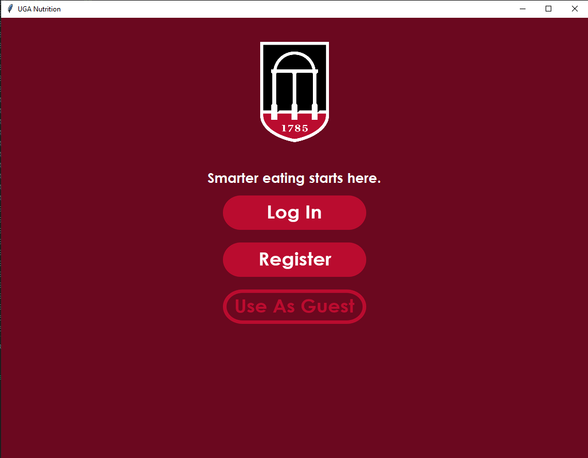
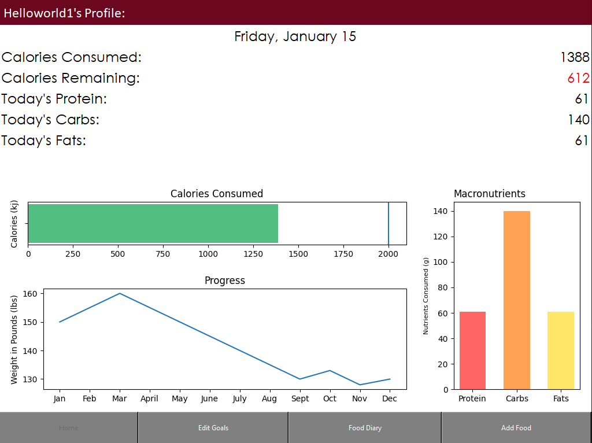
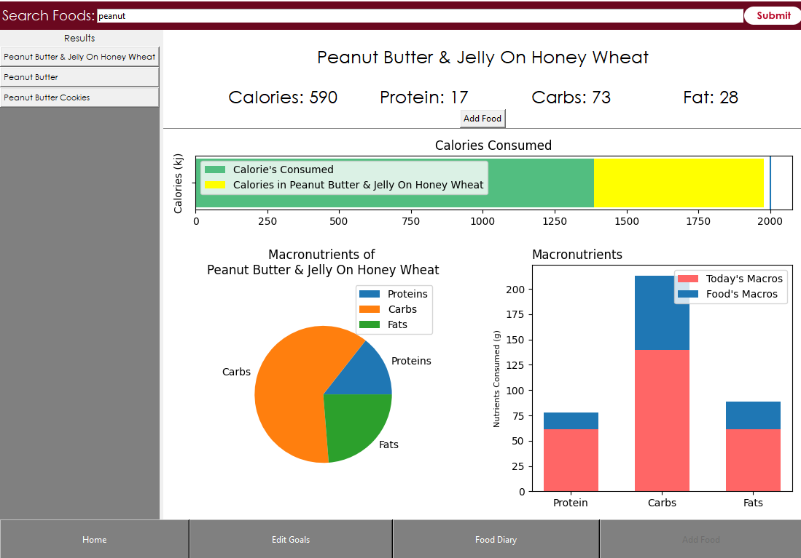

## Welcome to my UGANutrition Website

Below I will be showcasing some features that my application will offer and it's capabilities. This application will only be available for download onto computers, but will be made available for web browsers and mobile phones in the future. I am open to any suggestions just email me at yaudev2601@gmail.com. Thank You!

Some features have not been implemented those will be mentioned at the bottom of the page.

## Account Management

With UGANutrition you will be able to create your own account to manage and track your journey. If that's not your cup of tea you can also continue to use the app as a guest.

## The Home Page
UGANutrition's home page features a variety of graphs that helps visualize a user's goals and current nutrition standings. These graphs include a Calorie Bar to show how many calories have been consumed and a line to denote the calorie goal, A macronutrient vertical bar graph to visualize the distribution of macronutrients of that day's diet.
At the top it also includes user information as well as those graphs but quantified into a list. Of course for each different food added the graph's will update automatically and reflect the changes.
*Note the weight progress graph has not been implemented yet and is only there for visual

## Customizing Your Plate
Much like the home page when a user want's to add their food they are met with a visually stunning UI with an explosion of information about the food they want to add. At the top there will be numerical values describing the contents of the food and at the bottom there are 3 graphs, 2 of which are very similar to those of the home page except for the fact that when a user selects a food there will be highlighted portions of the graphs to emphasize what they are adding onto there diet. Then there is a pie graph which visualizes the distribution of macronutrients for the food.

## To Be Implemented
### Food Diary
The Food Diary is going to be an important part of this app. It will allow the user to save the food they ate for the day -- they can log out and log back in and still have the same food saved, EDIT their currently consumed food list which is not a feature yet, and allow the user to CHANGE THE DAY to previous days. Of course I am extremely excited to provide this update but I am going to need some time to make sure everything is perfect.
### Edit Goals
The Edit Goals tab will be a simple page where you can configure your goal weight, and how many calories you want to eat in a day.

## How to Download
Currently there is no download support available for people who dont want to have to install python and the dependencies. There will be one out soon

## Timeline
Right now I am working on a backend API for my application to communicate with my database, and after that I will release a first version for download, and then I am going to implement Food Diary.

## Support or Contact
If you have any questions so far you can email me at yaudev2601@gmail.com
Thanks for visiting!
