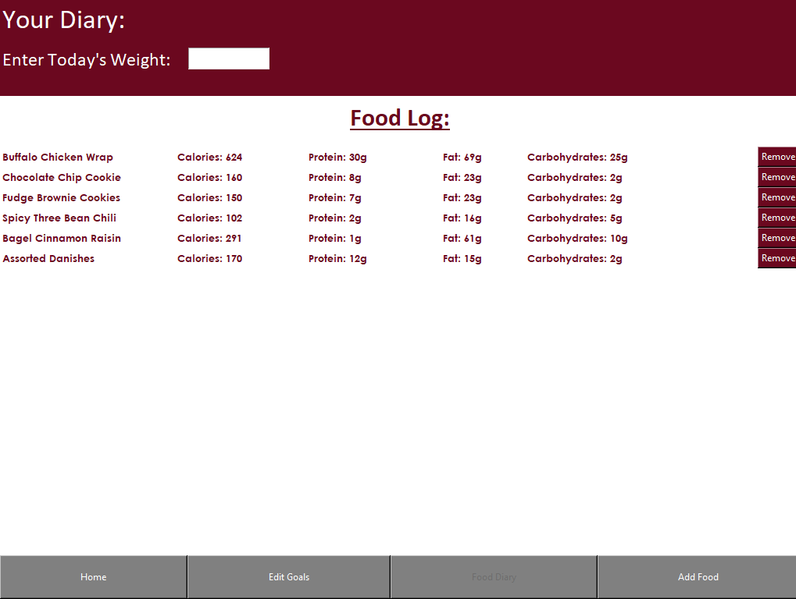
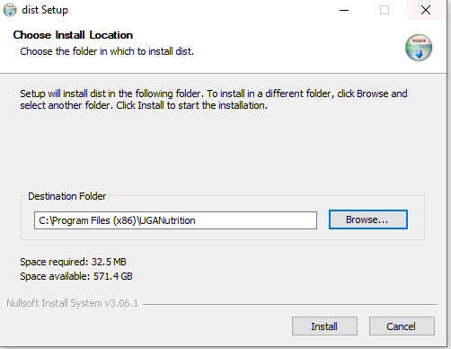
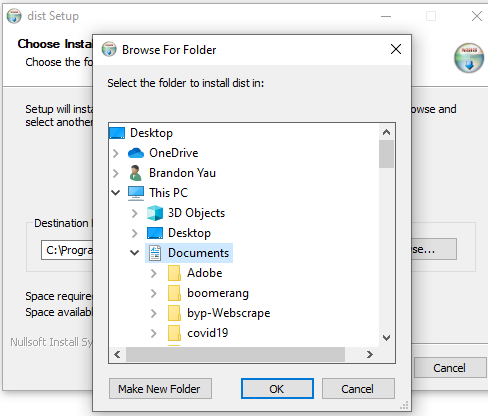

## Welcome to my UGANutrition Website

**NOTICE I WAS NOT ENDORSED OR SPONSORED BY UGA TO MAKE THIS APP.
I saw something that needed improving so I wanted to do it myself

Below I will be showcasing some features that my application will offer and it's capabilities. This application will only be available for download onto computers, but will be made available for web browsers and mobile phones in the future. I am open to any suggestions just email me at yaudev2601@gmail.com. Thank You!

Some features have not been implemented those will be mentioned at the bottom of the page.

## Account Management

With UGANutrition you will be able to create your own account to manage and track your journey. If that's not your cup of tea you can also continue to use the app as a guest.

## The Home Page
UGANutrition's home page features a variety of graphs that helps visualize a user's goals and current nutrition standings. These graphs include a Calorie Bar to show how many calories have been consumed and a line to denote the calorie goal, A macronutrient vertical bar graph to visualize the distribution of macronutrients of that day's diet.
At the top it also includes user information as well as those graphs but quantified into a list. Of course for each different food added the graph's will update automatically and reflect the changes.
*Note the weight progress graph has not been implemented yet and is only there for visual

## Customizing Your Plate
Much like the home page when a user want's to add their food they are met with a visually stunning UI with an explosion of information about the food they want to add. At the top there will be numerical values describing the contents of the food and at the bottom there are 3 graphs, 2 of which are very similar to those of the home page except for the fact that when a user selects a food there will be highlighted portions of the graphs to emphasize what they are adding onto there diet. Then there is a pie graph which visualizes the distribution of macronutrients for the food.

## Food Diary
A user's diary tab will keep list on everything the user has consumed for the day and will give them the option to remove something if added by mistake. With this tab the user can log out, come back and have their food saved into this diary and at some point I will be implementing a way to change the date so a user can review what he/she has eaten on a certain date. At the top there is also a place where you can enter your weight for the day so you can track your progress across a certain amount of time (Not fully implemented yet)

## To Be Implemented
### Edit Goals
The Edit Goals tab will be a simple page where you can configure your goal weight, and how many calories you want to eat in a day. There is functionality for edit calories but the page is still under design.

## How to Download
The first release of UGANutrition app came out on 01/16/2020. So far it is compatible with windows and you can download it by clicking the link below.
## Windows Instructions
### Link
[UGANutrition](https://github.com/bny11638/UGANutrition/raw/main/app/dist.exe)
Run the dist.exe downloadable and then you will get to this screen

\

Click Browse and select an easy to find directory like Documents.

You should be able to find the UGANutrition.exe inside of the UGANutrition folder in Documents
and you can create a shortcut if you want to put it on your desktop

## Timeline
I just released the app's first downloadable, and I am going to implement date changing and an updated edit goals frame at some point.

## Support or Contact
If you have any questions so far you can email me at yaudev2601@gmail.com
Thanks for visiting!
